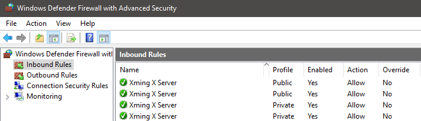
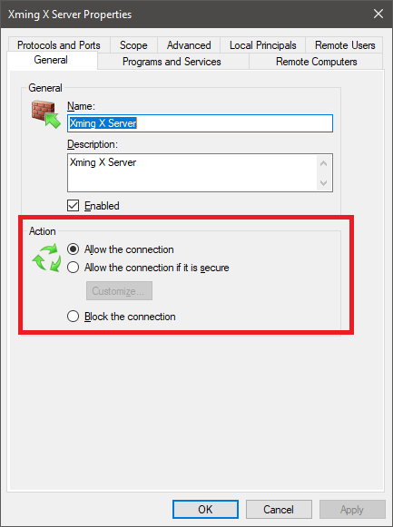
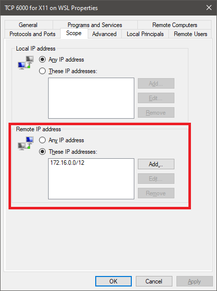

## CentOS WSL2

### Download and Installation

1. Download and Enable WSL2
2. There are several  distros:
    - [CentOS-WSL](https://github.com/mishamosher/CentOS-WSL) (by [mishamosher](https://github.com/mishamosher)) : CentOS based on qcow2 image
    - [FedoraWSL](https://github.com/yosukes-dev/FedoraWSL) (by [yosukes-dev](https://github.com/yosukes-dev)) : Fedora on WSL
    - [RHWSL](https://github.com/yosukes-dev/RHWSL) (by [yosukes-dev](https://github.com/yosukes-dev) : RedHat UBI on WSL
3. Download and run the included exe file

### Xming

#### Windows10 Setup on **Private Network**

Allow Plubic inbound connection for both Xming Servers

1. From **Windows Defender Firewall** -> **Advanced Setting** -> **Inbound Rules**, double click the inbound rule to open up properties. 

    

2. Under **General** Tab and **Action Panel**, select **Allow the connection**.

    

Create a new rule to restrict TCP 6000 connection to X11 on WSL2

1. Under **Actions** menu, click **New Rule...** 

2. You will be asked to select **Rule Type**. Select **Port**.

3. For **Protocol and Ports**, select **TCP** and specific local port **6000**

4. Proceed with default or desired options and give this rule a name, for example: "TCP 6000 for X11 on WSL"

5. Edit properties of this newly create rule ("TCP 6000 for X11 on WSL"). Under **Scope** tab **Remote IP address** panel, select **Theses IP addresses** then **Add** IP address **172.16.0.0/12**. 

    

6. **!!ONLY ON PRIVATE NETWORK!!**, Launch Xming with `-ac` option. 
    
    ```
    "C:\Program Files (x86)\Xming\Xming.exe" :0 -clipboard -multiwindow -ac
    ```

#### CentOS7 WSL2 Setup

1. Install `xrdp`

    ```sh
    sudo yum -y install xrdp
    ```

2. Apply some hack to change permission on `systemctl` on WSL2. `systemctl` is disabled by default.  

    ```sh
    sudo mv /usr/bin/systemctl /usr/bin/systemctl.old
    sudo curl https://raw.githubusercontent.com/gdraheim/docker-systemctl-replacement/master/files/docker/systemctl.py > /usr/bin/systemctl
    sudo chmod +x /usr/bin/systemctl
    sudo systemctl start xrdp
    ```

3. Add this to `~/.bashrc`
    ```sh
    echo "export DISPLAY=$(cd /mnt/c && route.exe print | grep 0.0.0.0 | head -1 | awk '{print $4}'):0.0" > ~/.bashrc
    ```

## CentOS7 Basics

### User and Group

Add `USER`.
```sh
adduser USER
```

Set passwd for `USER`. Type in the password twice to confirm it.
```sh
passwd USER
```

Add `USER` to `GROUP`.
```sh
usermod -aG GROUP USER
```

Grant **sudo** privileges to `USER` by adding the user to the `wheel` group
```sh
usermod -aG wheel USER
```

Add `USER` to sudoers file
```sh
echo "USER  ALL=(ALL) NOPASSWD:ALL" | sudo tee /etc/sudoers.d/USER
```
```sh
echo "USER  ALL=(ALL) NOPASSWD:/var/www/,/usr/bin/" | sudo tee /etc/sudoers.d/USER
```

Switch to another `USER`
```sh
su USER
```

### Yum Install Packages

```sh
yum -y update
```

Find a `THING` from installable list
```sh
yum -y list | grep 'THING' 
```

Typical dev environment
```sh
yum -y groupinstall "Development Tools"
yum -y install gcc openssl-devel bzip2-devel libffi-devel wget
```

#### Git

Upgrade Git to latest version
```
yum -y remove git*
yum -y install https://packages.endpointdev.com/rhel/7/os/x86_64/endpoint-repo.x86_64.rpm
yum -y install git
```

Change default branch name to main
```sh
git config --global init.defaultBranch main
```

#### Python

```
sudo yum -y install centos-release-scl-rh
sudo yum -y install rh-python38
sudo yum -y install rh-python38-python-devel rh-python38-python-tkinter rh-python38-python-numpy rh-python38-python-jinja2 rh-python38-python-scipy
source scl_source enable rh-python38
echo "source scl_source enable rh-python38" > ~/.bashrc
```
