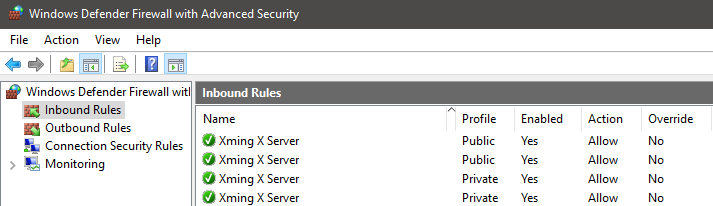
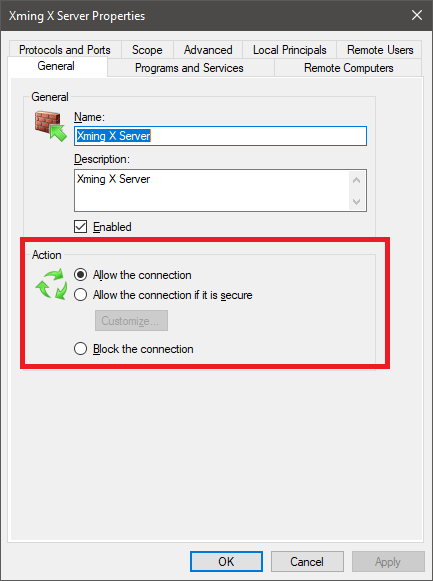
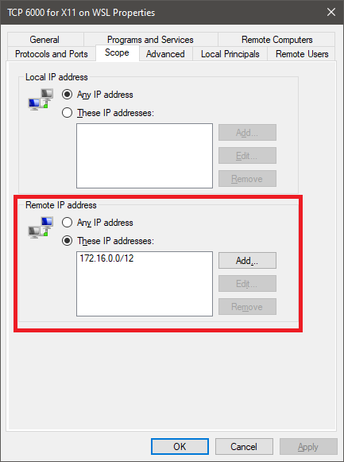

## CentOS on WSL2

### Table of Contents

- [Download and Installation](#download-and-installation)
- [CentOS Basics](#centos-basics)
    - [User and Group](#user-and-group)
    - [Yum Packages](#yum-packages)
        - [Generic](#generic)
        - [Git](#git)
        - [Python](#python)
    - [Other Packages](#other-packages)
    - [Xming](#xming)
    - [Enable systemctl](#enable-systemctl)

## Download and Installation

1. [Download WSL](https://docs.microsoft.com/en-us/windows/wsl/install) then [enable WSL2](https://docs.microsoft.com/en-us/windows/wsl/install#upgrade-version-from-wsl-1-to-wsl-2)
2. There are several distros:
    - [CentOS-WSL](https://github.com/mishamosher/CentOS-WSL) (by [mishamosher](https://github.com/mishamosher)) : CentOS based on qcow2 image
    - [FedoraWSL](https://github.com/yosukes-dev/FedoraWSL) (by [yosukes-dev](https://github.com/yosukes-dev)) : Fedora on WSL
    - [RHWSL](https://github.com/yosukes-dev/RHWSL) (by [yosukes-dev](https://github.com/yosukes-dev)) : RedHat UBI on WSL
3. Download and execute the included exe file

## CentOS Basics

### User and Group

Add `USER`.
```sh
adduser USER
```

Set passwd for `USER`. Type in the password twice to confirm it.
```sh
passwd USER
```

Add `USER` to `GROUP`.
```sh
usermod -aG GROUP USER
```

Grant `sudo` privileges to `USER` by adding the user to the `wheel` group
```sh
usermod -aG wheel USER
```

Add `USER` to sudoers file
```sh
echo "USER  ALL=(ALL) NOPASSWD:ALL" | sudo tee /etc/sudoers.d/USER
```
```sh
echo "USER  ALL=(ALL) NOPASSWD:/var/www/,/usr/bin/" | sudo tee /etc/sudoers.d/USER
```

Switch to another `USER`
```sh
su USER
```

### Yum Packages

```sh
yum -y update
```

#### Generic
```sh
yum -y groupinstall "Development Tools"
yum -y install gcc openssl-devel bzip2-devel libffi-devel wget epel-release
```

#### Git

```sh
# Upgrade Git to latest version
yum -y remove git*
yum -y install https://packages.endpointdev.com/rhel/7/os/x86_64/endpoint-repo.x86_64.rpm
yum -y install git
# Change default branch name to main
git config --global init.defaultBranch main
```

#### Python

```sh
# install Python 3.8
sudo yum -y install centos-release-scl-rh
sudo yum -y install rh-python38
sudo yum -y install rh-python38-python-devel rh-python38-python-tkinter rh-python38-python-numpy rh-python38-python-jinja2 rh-python38-python-scipy
# reference: https://access.redhat.com/solutions/527703 
source scl_source enable rh-python38
echo "source scl_source enable rh-python38" >> ~/.bashrc
```

### Other Packages

#### Docker Desktop

> https://docs.docker.com/desktop/windows/wsl/

#### Rancher Desktop

> https://towardsaws.com/rancher-desktop-on-wsl-d00b808540cb

#### Slurm

> https://nablacfd.github.io/2019/01/27/Notes-of-installing-slurm-in-Ubuntu-WSL/

Not tested yet

#### Terraform

> https://learn.hashicorp.com/tutorials/terraform/install-cli


#### Jenkins

> https://www.jenkins.io/doc/book/installing/linux/#red-hat-centos

Requires [enabling systemctl](#enable-systemctl). 

```sh
sudo wget -O /etc/yum.repos.d/jenkins.repo \
    https://pkg.jenkins.io/redhat-stable/jenkins.repo
sudo rpm --import https://pkg.jenkins.io/redhat-stable/jenkins.io.key
sudo yum upgrade
# Add required dependencies for the jenkins package
sudo yum install java-11-openjdk
sudo yum install jenkins
sudo systemctl daemon-reload
```

#### CUDA

> https://docs.nvidia.com/cuda/wsl-user-guide/index.html


### Xming 

> https://stackoverflow.com/questions/61110603/how-to-set-up-working-x11-forwarding-on-wsl2

Both Windows and CentOS requires configuration. CentOS 7 was used.  

Windows Setup:

1. Install [Xming](https://sourceforge.net/projects/xming/) and execute it. 

2. From **Windows Defender Firewall** -> **Advanced Setting** -> **Inbound Rules**, double click on oPublic inbound rules to open up their properties. 

    

3. Under **General** Tab, select **Allow the connection**.

    

Create a new rule to restrict TCP 6000 connection to X11 on WSL2

1. Under **Actions** menu, click **New Rule...** 

2. You will be asked to select **Rule Type**. Select **Port**.

3. For **Protocol and Ports**, select **TCP** and specific local port **6000**

4. Proceed with default or desired options and give this rule a name, for example: "TCP 6000 for X11 on WSL"

5. Edit properties of this newly create rule ("TCP 6000 for X11 on WSL"). Under **Scope** tab **Remote IP address** panel, select **Theses IP addresses** then **Add** IP address **172.16.0.0/12**. 

    

6. Launch Xming with `-ac` option. 
    
    ```
    "C:\Program Files (x86)\Xming\Xming.exe" :0 -clipboard -multiwindow -ac
    ```

CentOS Setup:

1. Install `xrdp` 

    ```sh
    sudo yum -y install xrdp
    ```

2. [Enable systemctl](#enable-systemctl) and start `xrdp`

    ```sh
    sudo systemctl start xrdp
    ```

3. Setup `.bashrc` to automatically set `DISPLAY`:
    ```sh
    echo "export DISPLAY=$(cd /mnt/c && route.exe print | grep 0.0.0.0 | head -1 | awk '{print $4}'):0.0" >> ~/.bashrc
    ```

### Enable systemctl

`systemctl` is disabled by default in WSL2. There are multiple workarouds however. 

Here is an example of wrapping `systemctl` with Python2 but does not work for those services explicitly require systemd. 
> https://superuser.com/questions/1556609/how-to-enable-systemd-on-wsl2-ubuntu-20-and-centos-8

```sh
sudo mv /usr/bin/systemctl /usr/bin/systemctl.old
sudo curl https://raw.githubusercontent.com/gdraheim/docker-systemctl-replacement/master/files/docker/systemctl.py > /usr/bin/systemctl
sudo chmod +x /usr/bin/systemctl
```